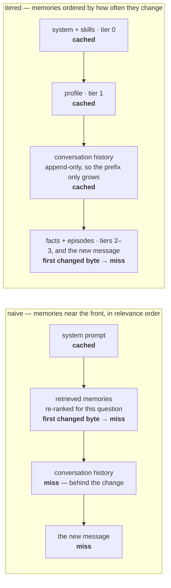

# MemoryLedger

[](https://github.com/Ranj04/Ledge/actions/workflows/ci.yml)

**An agent that remembers more should not cost more.**

Prompt caching only pays when the *front* of the prompt is byte-identical to the previous call.
An agent's prompt is rebuilt every turn, and memory retrieval puts a freshly ranked block near the
front — so every turn misses, and the more an agent remembers, the more each turn costs.
MemoryLedger orders retrieved memories by how often they change, so the stable part of the prompt
stays cacheable, and keeps a ledger of what each memory costs per month.

**Measured live: the same memories, re-ordered, cut input-side cost by 42.9%.** Real OpenAI
responses, `gpt-5.6-terra`, 2026-08-07, `cached_tokens` read off the wire. The baseline had caching
switched on too and scored 0.0%. The JSON artifact of that run was not retained;
[the headline number](#the-headline-number) says exactly what was measured and what was not.

## The whole idea in one picture



A cache hit ends at the first byte that differs from an earlier call, and every block after it is
billed at full price. `naive` changes at its second block, so only the system prompt ever hits.
`tiered` changes at its fourth, so everything above the final turn hits. Same memories, same
information, same answer — the only difference is where the churn sits.

---

## Run it

Clone to running takes about a minute — no credentials, and no network once the tokenizer table is
cached. Python 3.12 and Node 20. The virtual environment's interpreter is `.venv/bin/python` on
macOS and Linux and `.venv/Scripts/python.exe` on Windows; every command in this document is
written in the first form, and the second is a straight substitution.

```bash
python -m venv .venv                          # any Python 3.12; or: uv venv --python 3.12 .venv
.venv/bin/pip install -r requirements.txt     # Windows: .venv\Scripts\pip install -r requirements.txt
cd web && npm install && npm run build && cd ..

# The token counter's BPE table: one network fetch, ever. Everything else is offline.
.venv/bin/python -c "import tiktoken; tiktoken.get_encoding('cl100k_base')"

# Fill the ledger. It ships empty — data/ledger.db is generated, not seeded — so without
# this step the dashboard opens on zeros.
.venv/bin/python scripts/experiment.py --runs 4 --record

.venv/bin/python -m app
```

Open <http://localhost:8000>. No credentials needed — it runs against faithful simulators, and the
UI says on screen whether the provider is a simulator.

<!-- screenshots: uncomment once the two PNGs exist — docs/screenshots/README.md says how to capture them.

*The tutor with the cost meter. Provider: simulator — cache accounting from the billing rule, replies simulated.*


*The per-memory cost dashboard, filled by `scripts/experiment.py --record` against the simulator.*
-->
*Screenshots: not yet captured. [`docs/screenshots/README.md`](docs/screenshots/README.md) says how
to produce the two that belong here — the tutor with its cost meter, and the per-memory dashboard.*

`TIKTOKEN_CACHE_DIR` can point at a directory that already holds the BPE blob, for a machine with
no network at all. Snowflake and the embedding scorer are optional:
`pip install -r requirements-snowflake.txt`.

For the real memory layer, EverOS runs self-hosted alongside (free, no per-operation charge, and
no network hop):

```bash
docker compose up -d everos    # published on host port 8077
curl localhost:8077/health
```

## What a careful reader will find

- **Measured in dollars, not percentages.** The four prompt formats this repository went through
  are compared on the same corpus in
  [the simulator table](#what-the-provenance-delimiter-did-to-the-numbers-simulator-2026-09-10):
  the one that raised the *reduction* by half a point raised the *bill* by 59%.
- **Simulated where it has to be, and labelled.** Without an API key the model's replies come from
  a simulator, and the cache accounting comes from a re-implementation of the provider's billing
  rule — prefix hashing, breakpoints, TTL — not from a stub. Every file in [`results/`](results/)
  says which kind it is.
- **Adversarial.** A 29-case prompt-injection corpus that the memory format defeats
  (`tests/test_injection.py`), and a separate suite of cross-review tests — this was built by two
  models, each writing cases to break the other's work (`tests/review/`).
- **Negative results kept.** `app/cortex/openai_client.py` records that explicit cache breakpoints
  measured seven points *worse* than implicit caching on OpenAI, and the code follows the
  measurement rather than the design.

**288 tests** pass in CI on every push; the **76** adversarial tests pass locally. The repository is
named `Ledge`; the Python distribution is `memoryledger`. The study tutor it runs under is the demo
surface, not the product: it exists so there is a person to care about and so the system generates
realistic memory pressure.

## How it works

**1. Cache-aware memory layout.** The Context Assembler sorts retrieved memories by *volatility* —
stable first, volatile last — and marks cache breakpoints at the tier boundaries. Same memories,
same information, same answer, lower bill.

OpenAI's own guidance is to put static content first and variable content last. Every memory
framework violates it by default, because retrieval is dynamic and the retrieved block goes near the
front. This enforces the provider's own advice on the one part of the prompt nobody applies it to.

**2. A per-memory cost ledger.** Every call records which memories were injected and what each one
cost, at the rate its region of the prompt was actually billed at. Rolled up, that is a per-memory
monthly cost. An ablation harness then replays calls with one memory removed and scores whether the
answer changed. Memories that cost money and change nothing become eviction candidates.

---

## The headline number

```bash
CORTEX_PROVIDER=openai .venv/bin/python scripts/experiment.py --runs 4
```

```
  MemoryLedger — input-side cost per conversation
  LIVE — real OpenAI
  3 conversations × 4 runs = 12 per mode
  model gpt-5.6-terra

  mode           mean     median     stdev        min        max    hit rate
  naive    $ 0.056849 $ 0.056060 $0.004360 $ 0.052278 $ 0.066220       0.0%
  tiered   $ 0.032565 $ 0.031776 $0.004360 $ 0.027994 $ 0.041936      47.9%

  reduction   mean 42.9%   median 43.3%   range 36.7%–46.5%   stdev 3.13%
  total cost  naive $0.081158  tiered $0.064006  −21.1%
  prompt size   naive 28,425 tok   tiered 28,530 tok   (same content, different layout)
```

**Live — real OpenAI, `gpt-5.6-terra`, measured 2026-08-07.** The 42.9% mean reduction, the 47.9%
`tiered` hit rate and the 0.0% `naive` hit rate in that headline block were read off
`usage.prompt_tokens_details` in real API responses. The JSON artifact of that run was not retained
(`BLOCKERS.md`, "No live `results/*.json` artifact exists"), and there is no `OPENAI_API_KEY` on the
build machine to re-run it.

Machine-readable runs: [`results/`](results/) — simulator runs only; the 2026-08-07 live run is not
among them.

### What the provenance delimiter did to the numbers (simulator, 2026-09-10)

The text sent to the model has changed three times. Stage 2 rendered every memory as a
`<memory id type origin>` element instead of a `- ` bullet (`DECISIONS.md` D41); Stage 3 moved
the provenance to one `<tutor_notes>` / `<observations>` wrapper per region (D42); Stage 4 put
it on the first character of each line — `- ` for the tutor's own notes, `> ` for what was
recorded from the student — so it costs the same however the memories are ordered (D43). The
live **42.9%** headline was measured on **2026-08-07** against the plain bullet format and has
**not** been re-measured live — there is no `OPENAI_API_KEY` on the build machine. The
simulator was run against all four formats on the same corpus and the same scripted
conversations, 3 × 4 runs each; the markup is the only difference between the columns.

| input-side, per conversation | `- ` bullets ([`results/2026-09-10-simulator.json`](results/2026-09-10-simulator.json)) | `<memory>` elements ([`…-stage2.json`](results/2026-09-10-simulator-stage2.json)) | region wrappers ([`…-stage3.json`](results/2026-09-10-simulator-stage3.json)) | per-line marks ([`…-stage4.json`](results/2026-09-10-simulator-stage4.json)) | stage 4 vs bullets |
|---|---|---|---|---|---|
| **cost, naive** | **$0.05115** | **$0.08207** | **$0.05231** | **$0.05206** | **+1.8%** |
| **cost, tiered** | **$0.02437** | **$0.03873** | **$0.02497** | **$0.02461** | **+1.0%** |
| reduction, mean (naive → tiered) | 52.35% | 52.81% | 52.26% | 52.72% | +0.37 pt |
| cache hit rate, tiered | 61.88% | 62.56% | 62.06% | 62.30% | +0.41 pt |
| prompt tokens, naive | 25,574 | 41,035 | 26,155 | 26,029 | +1.8% |
| prompt tokens, tiered | 25,686 | 41,504 | 26,414 | 26,141 | +1.8% |
| total cost incl. output, naive / tiered | $0.06306 / $0.03629 | $0.09399 / $0.05064 | $0.06423 / $0.03689 | $0.06397 / $0.03653 | +1.4% / +0.7% |

**Read the dollars, not the percentage.** Stage 2's reduction went *up* by half a point while
the bill went *up* by 59%: the element added ~21 tokens to each of the ~104 memories a turn
retrieves (~2,200 tokens per call), and because 78 of those memories sit in the cached prefix,
most of the new tokens were billed at the cache-read rate in `tiered` and at the full rate in
`naive` — which raises the *fraction* saved while raising the *amount* paid in both modes.
Stage 4 recovers 97–98% of that rise. What is left over bullets is one thing: a 65-token
paragraph in the system prompt that tells the model what the two marks mean (tier 0, so
cached after the first turn) — the +455 prompt tokens per 7-turn conversation in *both* modes
is that paragraph and nothing else. The mark itself costs exactly what the original `- `
bullet cost: `-` and `>` are one `cl100k_base` token each and the rest of the line tokenises
identically under either, so memory tokens on a first turn are 3,019 under Stage 1 and 3,019
under Stage 4. That is also why `naive` can keep its defining global relevance order (Stage
3's wrappers had made that order cost 94 lines a turn, and D42 had bent the baseline to avoid
paying it). What the markup buys is unchanged: `tests/test_injection.py`, 29 hostile memories,
70 tests, none of which can forge a header, wear the other side's mark, or pass as an
instruction — and, since Stage 4, the student's question cannot be re-read as a memory either.

**The hit rate is measured against the whole prompt.** `cache_hit_rate` is `cached_tokens / input_tokens`, and `input_tokens` is the *total* prompt — cached, written, and the current turn, which can never be cached. Dividing by the cacheable region instead would produce a larger number; this is the conservative framing and `/api/chat` and the session totals use it identically.

**The baseline is not denied anything.** Caching on OpenAI is implicit and on by default, so `naive`
had it too in the 2026-08-07 live run — and still measured **0.0%**, because memories retrieved per
turn sit at the front of the prompt and change every turn. The same memories ordered stable-first
cached 47.9% in that run.

The headline is **input-side** cost, the only side caching can touch. Total cost is reported next to
it and is lower: output tokens are the same work in both modes and dilute the percentage. Against a
real model the two modes sample independently, so replies differ in length by ~20% — folding that
into a caching number would be measuring sampling noise.

---

## Why the numbers are real

Two kinds of measurement appear in this document, and each carries its own provenance:

- **The headline — 42.9% mean input-side reduction, 47.9% `tiered` hit rate, 0.0% `naive`.**
  **Live.** Measured against real OpenAI responses (`gpt-5.6-terra`) on **2026-08-07**. The JSON
  artifact of that run was not retained (`BLOCKERS.md`, "No live `results/*.json` artifact exists"),
  and there is no `OPENAI_API_KEY` on the build machine to reproduce it.
- **The Stage 1 / 2 / 3 / 4 comparison table** ("What the provenance delimiter did to the numbers").
  **Simulator.** All four columns come from `CORTEX_PROVIDER=sim` runs on 2026-09-10, all
  committed — `results/2026-09-10-simulator.json`, `…-stage2.json`, `…-stage3.json` and
  `…-stage4.json` — and none is a live measurement.
- **The two are not the same instrument, and the difference is quantified.** The simulator
  implements Cortex's explicit-breakpoint rule, under which our breakpoint on the last assistant
  turn lets the cached prefix grow by one exchange per turn. OpenAI's implicit cache looks up only
  at user-message endings and the system block (its documentation, quoted in
  `tests/test_integration_modes.py`), and with the current layout none of ours ever match: live, the
  cached prefix stayed at the system message for a whole conversation. Over the seeded sweep that
  history credit is 6,740 of 78,424 tiered prompt tokens; clamp it and the simulator's 52.7% reads
  42.8%, beside the live 42.9%. The Stage 1 / 2 / 3 / 4 simulator table carries Cortex-rule
  figures — its *deltas* are sound, its absolute tiered figures are not OpenAI figures. Quote the
  live 42.9% for OpenAI. The diagnosis, and the layout that would recover the credit on OpenAI, are in
  `BLOCKERS.md`, "tier 1 is byte-stable but does not cache" (`DECISIONS.md` D48).

In both cases `cached_tokens` is **derived**, never assigned: on a live call it is read off
`usage.prompt_tokens_details` in the API response; offline it comes from the simulator's prefix
computation. No code path assigns it.

Every external dependency sits behind a `Protocol` in `app/contracts.py` with a real client and a
simulator, switched by one environment variable. That was built because we had no sponsor
credentials, and it is what made swapping the inference provider a one-file change.

**The simulators are not stubs.** `MockCortexClient` implements the *billing rule*: byte-exact
prefix hashing at every block boundary, writes only at breakpoints, **reads that walk backward up
to 20 blocks** looking for an entry an earlier request wrote, a token-count minimum, at most 4
breakpoints, a TTL refreshed on hit. We got that lookback wrong at first and it mattered: under the
wrong model the conversation-history breakpoint looked worthless and we nearly deleted it.
Correcting the instrument is what surfaced the layout in use today (`DECISIONS.md` D16, D17).

Two measurement bugs are worth knowing about, because both produced confident, plausible, wrong
numbers with no error anywhere:

- Pointing the experiment at a memory store without our seeded students gave a complete run at
  **7.8%**. It now refuses to report anything if a turn retrieves fewer than 20 memories
  (`DECISIONS.md` D21).
- Reusing a `prompt_cache_key` between invocations let one sweep read the *previous* sweep's warm
  cache. Naive went from a true 0.0% to a contaminated 76.2% and appeared to win by 90%. Session ids
  now carry a per-invocation nonce (`DECISIONS.md` D32).

**What is simulated:** with `CORTEX_PROVIDER=sim`, the model's replies and therefore the ablation
verdicts — see `DECISIONS.md` D10. The UI shows the provider state on screen at all times.

**What is not measured on the live path:** cache *write* tokens. The OpenAI API reports reads and
not writes, so `app/cortex/openai_client.py` reports `cache_write_tokens` as zero rather than
guessing. Writes bill at 1.25× and land on tokens *not* served from cache — which is the naive
baseline, at 0.0% cached. Counting them would widen the gap, so the 2026-08-07 live 42.9% is a floor
(`BLOCKERS.md`). The simulator does derive write tokens (`app/cortex/cache_sim.py`) and prices them
at the write rate, so the Stage 1 / 2 / 3 / 4 simulator table already includes them.

## Is the baseline fair?

`naive` mode puts memories at the front of the prompt in relevance order with no breakpoints — how
a memory-augmented agent is built when nobody has thought about caching. It is production code, not
a strawman. Both modes retrieve **the same memories** and put **the same information** in front of
the model; two tests fail the build if that stops being true. The argument in full is `DECISIONS.md`
D6.

---

## Where things are

- [`README.md`](README.md) — the product, evidence, and local run path.
- [`DECISIONS.md`](DECISIONS.md) — the recorded technical reasoning.
- [`BLOCKERS.md`](BLOCKERS.md) — limitations, corrections, and unresolved work.
- [`results/`](results/) — machine-readable measurement artifacts and provenance.
- [`docs/history/`](docs/history/) — dated records from the build and the event it was built for; not maintained.

## Layout

```
app/assembler/   ← the product: tiering, ordering, breakpoint placement, tier drift
app/cortex/      inference + the cache simulator (the measurement instrument)
app/everos/      memory retrieval
app/telemetry/   ledger, cost math, reconciliation
app/api/         FastAPI: streaming chat, dry-run inspector, ledger endpoints
web/             React SPA — tutor, cost meter, prompt inspector, dashboard
seed/            deterministic student + fleet generator
ablation/        does removing this memory change the answer?
sql/             Snowflake DDL, rollups, reconciliation
```

| Tier | EverOS type | Changes | Cached |
|---|---|---|---|
| 0 Frozen | system prompt + `Skills` | on re-distillation only | yes |
| 1 Durable | `Profiles` | weeks–months | yes |
| 2 Slow | `Facts` | days — and the retrieved subset churns per query | no |
| 3 Volatile | `Episodes`, `Foresights`, `Cases` + the new message | every turn, or unknown | no |

Types and tiers live in exactly one module, `app/memory_types.py`; the frontend reads it from
`/api/status` rather than keeping a copy. `Foresights` and `Cases` sit in tier 3 as a deliberate
safe default — calling a volatile type stable destroys the cache for every tier behind it, while
calling a stable type volatile only forgoes some savings (`DECISIONS.md` D24).

Order is by **measured prefix stability**, not tier number: `0 → 1 → conversation history → 2 → 3`.
Conversation history is append-only so its prefix never changes; a top-k retrieval reshuffles every
question. A churning block poisons every stable block behind it, so `Facts` ride *behind* the
history (`DECISIONS.md` D17).

On OpenAI that ordering is the entire mechanism: caching is implicit, so the longest stable prefix is
reused automatically and the Assembler's breakpoints are not sent. We measured explicit breakpoints
against implicit caching and they came out **seven points worse** — `prompt_cache_options.mode =
"explicit"` disables the automatic longest-prefix match, and you pay a 1.25× write surcharge for
breakpoints that were not buying anything (`DECISIONS.md` D29). On Anthropic-style APIs, where
nothing caches unless a breakpoint says so, placement is load-bearing and the breakpoints matter.

## Tests

```bash
.venv/bin/python -m pytest -q --ignore=tests/review   # 288 passed, 1 xfailed — the CI gate, measured 2026-09-10
.venv/bin/python -m pytest -q tests/review            # 76 passed — the cross-model review tests, run locally
```

## Running against real providers

Three switches, one per dependency, so a failure is always attributable. Nothing on the real
Snowflake path has been run since 2026-08-07, and every line that rests on an unverified
assumption is marked `# VERIFY-WITH-CREDENTIALS:` where it sits — 23 in `.py` files, one in
`sql/`; `BLOCKERS.md` says what each needs. `tests/probe_openai_live.py` checks the cache mechanic
and then the layout effect over a real conversation, and exits non-zero if either fails.
`docs/history/EVENT_DAY.md` is the checklist that was used to go live for the event, kept as a
record.

```
CORTEX_PROVIDER=openai|sim|real   inference   (real = Snowflake Cortex)
EVEROS_PROVIDER=sim|real          memory
LEDGER_PROVIDER=sqlite|duckdb|snowflake  ledger
```

Inference is OpenAI because the Snowflake trial account carries no Cortex entitlement on any
surface. Snowflake holds the ledger and the economics rollups. The Cortex client is written and
works — `CORTEX_PROVIDER=real` is the entire change if the entitlement appears (`DECISIONS.md` D28).

The ledger has three backends from one schema declaration. `sqlite` is the default. `duckdb`
is the warehouse-grade one that runs with no account: the same tables, `sql/02_rollups.sql`
loaded as-is, and `tests/test_duckdb_store.py` holding it to SQLite's numbers on the same rows
— the first backend on which "the stores agree" is a test rather than a docstring
(`DECISIONS.md` D44). `snowflake` is written and has not run against a real account.

## Documents

| File | What it is |
|---|---|
| `DECISIONS.md` | Every ambiguous call and why |
| `BLOCKERS.md` | What could not be verified without credentials |
| `docs/history/` | Dated records, not maintained: the go-live checklist, the 3-minute demo script, the cross-agent handoff log |
